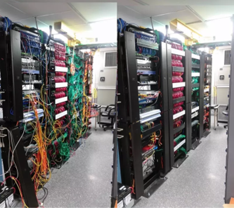

# エンジニアとは？
工学（エンジニアリング）に関する専門的な知識やスキルを持った人材のことを言います。

## エンジニアにはどんな種類があるの？
- システムエンジニア
- プログラマー
- インフラエンジニア
- ネットワークエンジニア
- セールスエンジニア
- Webエンジニア
- サーバーエンジニア
- フロントエンドエンジニア
- マークアップエンジニア
- データベースエンジニア
- 制御・組み込みエンジニア
- まだまだつづくのである…

## いくつかをご紹介
### インフラエンジニア

コンピュータにとって快適な場所でネットワークがつながるように作業する人。サーバー構築など。
特徴は365日24時間監視が必要であること。

 

