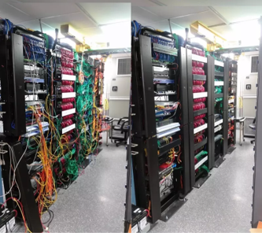

# エンジニアとは？
工学（エンジニアリング）に関する専門的な知識やスキルを持った人材のことを言います。

## エンジニアにはどんな種類があるの？
- システムエンジニア
- プログラマー
- インフラエンジニア
- ネットワークエンジニア
- セールスエンジニア
- Webエンジニア
- サーバーエンジニア
- フロントエンドエンジニア
- マークアップエンジニア
- データベースエンジニア
- 制御・組み込みエンジニア
- まだまだつづくのである…

## いくつかをご紹介
### インフラエンジニア

コンピュータにとって快適な場所でネットワークがつながるように作業する人。サーバー構築など。
特徴は365日24時間監視が必要であること。

 

### SE

会社のあらゆるシステムを構築する人。銀行や医療機関、メーカーなどに常駐していることが多い。

 

### マークアップエンジニア

通称コーダー。Webサイトの見た目を作る人。デザインにそって、Webサイトをマークアップするエンジニア。
デザインも一緒にやっている人も多い。

### フロントエンドエンジニア

マークアップ＋動きやアニメーション、APIとの連携などをプログラミングするエンジニア。
HTML、CSSに合わせてJavaScriptを主に使っている人が多い。

### バックエンドエンジニア
サーバーサイドのエンジニア。
サーバーで動く言語でプログラミングしている。
PHP、Perl、Ruby、Pythonなど。

## まとめ
いろりろと紹介してきましたが重要なのは自分がやりたいことは何かということと何に向いているかを
見極めることです。学校にいる間はいろいろな技術、言語に触れていきますのでその中でも自分が得意とする分野、
正直少し苦手だと思う分野は必ずあると思います。その記録と見極めが肝になりますのでそういった意識を持ちつつ
授業を受けるようにしましょう。